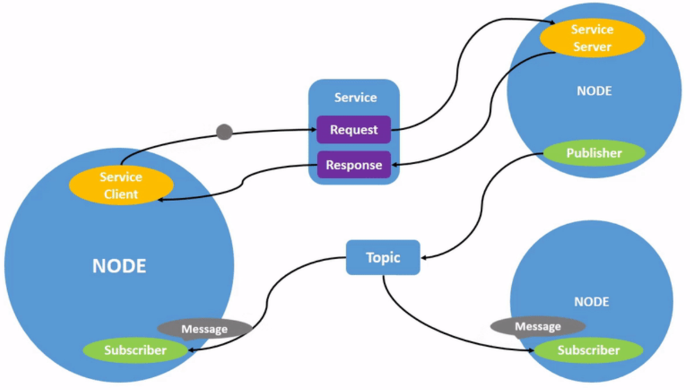
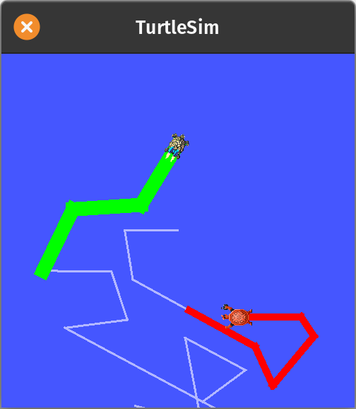
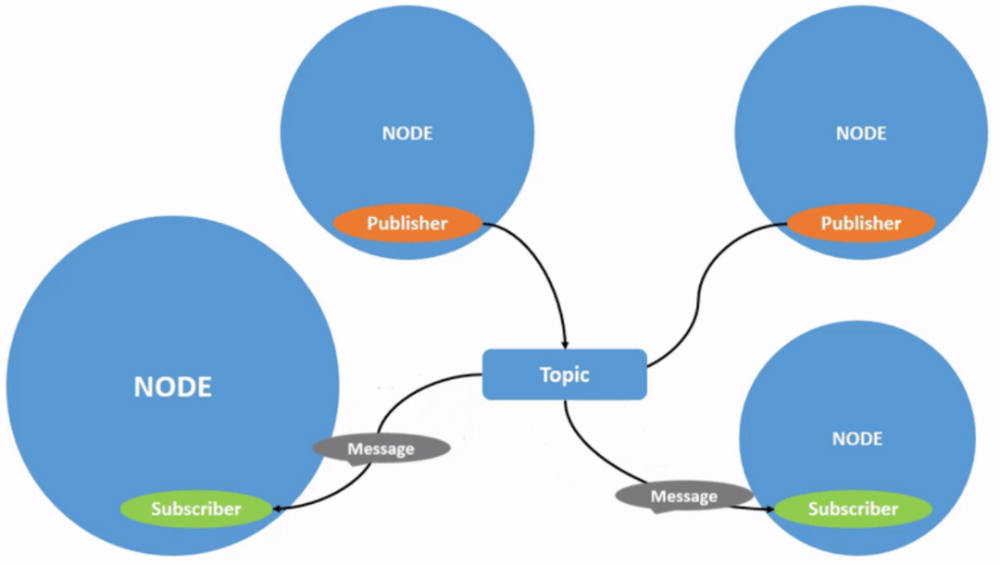
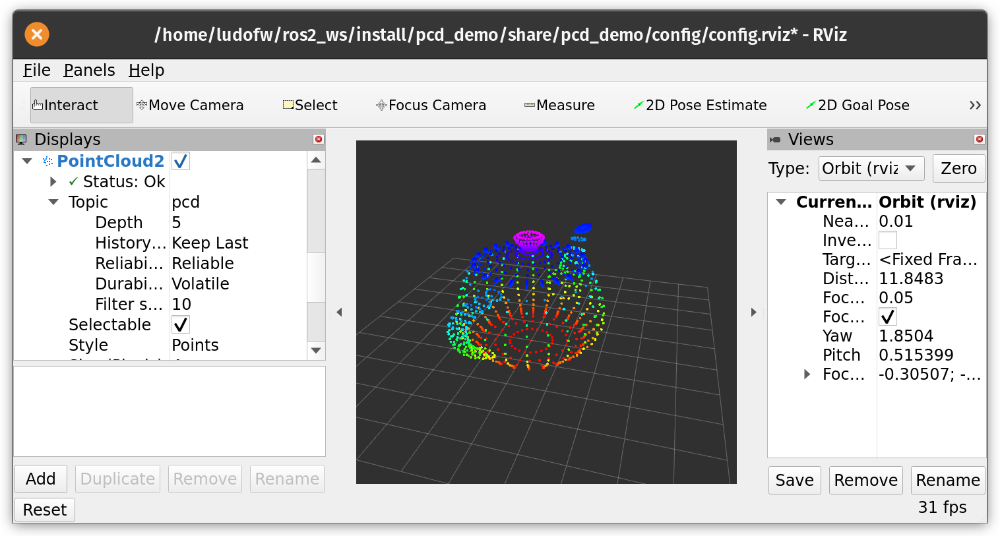
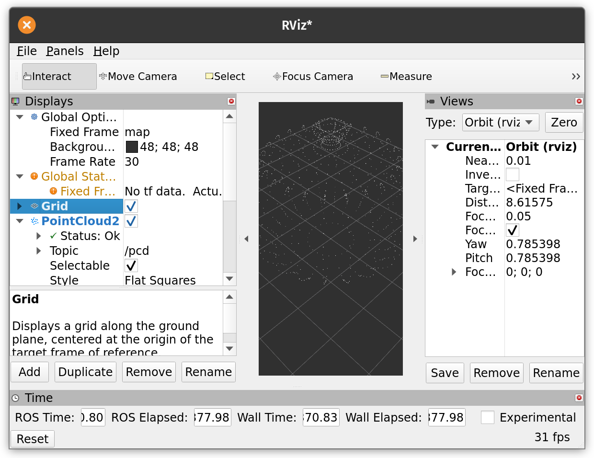

<!-- vim-markdown-toc Marked -->

* [ROS2know](#ros2know)
* [Introduction](#introduction)
* [Installation](#installation)
    * [RVIZ2](#rviz2)
* [Tutorials](#tutorials)
    * [workspaces](#workspaces)
    * [ROS2 packages](#ros2-packages)
    * [turtlesim](#turtlesim)
    * [nodes](#nodes)
    * [ROS Topics](#ros-topics)
* [Plugins](#plugins)
    * [PlotJuggler](#plotjuggler)
        * [using:](#using:)
* [rosbags](#rosbags)
* [How-To](#how-to)
    * [record rosbags](#record-rosbags)
    * [install colcon](#install-colcon)
    * [ros bags convertions](#ros-bags-convertions)
    * [play ros2 bag recorded on jazzy from humble](#play-ros2-bag-recorded-on-jazzy-from-humble)
    * [Gazebo installation](#gazebo-installation)
* [Using ROS with python](#using-ros-with-python)
    * [managing packages, virtual environment](#managing-packages,-virtual-environment)
    * [import local package or module](#import-local-package-or-module)
* [git repos and tutorials](#git-repos-and-tutorials)
    * [building a simple robot controller](#building-a-simple-robot-controller)
    * [nav2 crash course (video)](#nav2-crash-course-(video))
    * [ROS2 point cloud demo](#ros2-point-cloud-demo)
        * [Issues, errors](#issues,-errors)
* [ROS2 and opencv](#ros2-and-opencv)
    * [cv_bridge](#cv_bridge)
        * [installation](#installation)
        * [usage](#usage)
* [How-To](#how-to)
* [Error messages and solutions](#error-messages-and-solutions)
    * [error struct rosbag2_storage::SerializedBagMessage has no member named ‘timestamp’](#error-struct-rosbag2_storage::serializedbagmessage-has-no-member-named-‘timestamp’)
    * [when updating: error key](#when-updating:-error-key)
    * [time stamp mismatch](#time-stamp-mismatch)

<!-- vim-markdown-toc -->
# ROS2know

These are notes dedicated to my learning ROS, the Robotic Operating System.
Note: I work exclusively with Linux.

Most if not all will be about ROS2.

# Introduction

image from [understanding-ROS2-Nodes](https://docs.ros.org/en/iron/Tutorials/Beginner-CLI-Tools/Understanding-ROS2-Nodes/Understanding-ROS2-Nodes.html)

All robots based on ROS are programmed using five simple but core constructs, and you'll hear these often:
  - Nodes
  - Parameters
  - Topics
  - Services
  - Actions

# Installation

Follow the guide [here for ros2 humble](https://docs.ros.org/en/humble/Installation/Ubuntu-Install-Debians.html) or [here for ros2 iron](https://docs.ros.org/en/iron/Installation/Ubuntu-Install-Debians.html), installation was performed using the recommended Debian packages approach.
Installation went smoothly on Ubuntu 22.04 and Pop-OS 22.04.

    sudo curl -sSL https://raw.githubusercontent.com/ros/rosdistro/master/ros.key -o /usr/share/keyrings/ros-archive-keyring.gpg
    echo "deb [arch=$(dpkg --print-architecture) signed-by=/usr/share/keyrings/ros-archive-keyring.gpg] http://packages.ros.org/ros2/ubuntu $(. /etc/os-release && echo $UBUNTU_CODENAME) main" | sudo tee /etc/apt/sources.list.d/ros2.list > /dev/null
    sudo apt update && sudo apt install ros-dev-tools
    sudo apt install ros-iron-desktop

Do this in order to not having to source the ros setup.sh in every newly opened terminal.

    echo "source /opt/ros/[the_version_most_often_used]/setup.bash" >> ~/.bashrc

`[the_version_most_often_used]`: ex. `iron` or `humble`. We can't source 2 different versions of ros so chose one version to sourceautomatically in every new shell or don't add this to .bashrc. This can be overridden by manually sourcing a different ros version.

It is possible to install different versions of ros on the same machine, even mixing ros1 and ros2. But only one can be sourced at a time in a same shell. 
See this [robotics SE post](https://robotics.stackexchange.com/questions/24180/multiple-ros-installation-on-single-machine).

The ROS environment can be seen with :

    env | grep ROS

IT will show something like:

    ROS_VERSION=2
    ROS_PYTHON_VERSION=3
    ROS_DOMAIN_ID=0
    ROS_AUTOMATIC_DISCOVERY_RANGE=SUBNET
    ROS_LOCALHOST_ONLY=0
    ROS_DISTRO=humble

The warning: `ROS_DISTRO was set to 'iron' before. Please make sure that the environment does not mix paths from different distributions.`
occurs when in the same shell a new ros version `setup.bash` was sourced. See [related info here](https://answers.ros.org/question/62589/problem-with-the-terminal-ros_distro/).

ROS domain ID:

    echo "export ROS_DOMAIN_ID=<your_domain_id>" >> ~/.bashrc

I used 0 as it seems to be the default one to have turtlesim (see next in the tutorials) to respond to keyboard commands.

## RVIZ2

https://docs.ros.org/en/humble/Tutorials/Intermediate/RViz/RViz-User-Guide/RViz-User-Guide.html

Several sources say it should be installed along with ROS2 but for me it wasn't.

I did:

    sudo apt install ros-humble-rviz2

Test with:

    ros2 run rviz2 rviz2

# Tutorials

## workspaces

https://docs.ros.org/en/humble/Tutorials/Beginner-Client-Libraries/Creating-A-Workspace/Creating-A-Workspace.html

## ROS2 packages

https://docs.ros.org/en/jazzy/Tutorials/Beginner-Client-Libraries/Creating-Your-First-ROS2-Package.html

## turtlesim

Install the corresponding ros package and rqt utility:

    sudo apt install ros-iron-turtlesim
    sudo apt install ~nros-iron-rqt*

Open 2 terminal tabs / windows, in the first one enter:

    ros2 run turtlesim turtlesim_node

In the second:

    $ ros2 run turtlesim turtle_teleop_key

The turtle will respond to keyboard control from within the 2nd terminal window (i.e. in which the command `$ ros2 run turtlesim turtle_teleop_key` was entered), not in the turtlesim window itself!

WE'll now create a second turtle with the help of rqt.

Open a 3rd terminal tab/window, enter:

    rqt

Several 'services' should be available, go to plugins > Services > Service Caller.

In the dropdown menu select /Spawn and enter a name for a new turtle (in between the '').

The turtle may be created outside the visible area of the turtlesim window.
It should appear in the turtlesim_node terminal as:

    QImage::pixel: coordinate (0,532) out of range
    QImage::pixel: coordinate (0,532) out of range

In order to control the newly created turtle, a 'remapping' has to be done. In a 4th terminal, enter:

    ros2 run turtlesim turtle_teleop_key --ros-args --remap turtle1/cmd_vel:=turtle2/cmd_vel

This allows the control of the second turtle with the keyboard. From within that terminal, arrow keys will move the second turtle.

Change the pen color and width by opening the set_pen service from the dropdown menu, with the name of the turtle for which the pen is to be modified, ex: /turtle1/set_pen

Other services can be tried, such as TeleportAbsolute.

Always click on the Call button to execute the service.

## nodes

image from [understanding-ROS2-Topics](https://docs.ros.org/en/iron/Tutorials/Beginner-CLI-Tools/Understanding-ROS2-Topics/Understanding-ROS2-Topics.html)

ros2 node info /my_turtle

there's command completion available, pressing tab after `info ` shows the available nodes.

## ROS Topics

The tutorial can be found [here](ros2 topic echo /turtle1/cmd_vel)

Prepare 4 terminals.
In the 1st:

    ros2 run turtlesim turtlesim_node

In the 2nd:

    ros2 run turtlesim turtle_teleop_key

In the 3rd:

    rqt_graph

Then in the 4th, use a command line to list the current topics:

    ros2 topic list 

To see the data being published on a topic, use:

    ros2 topic echo <topic_name>

Since we know that /teleop_turtle publishes data to /turtlesim over the /turtle1/cmd_vel topic, let’s use echo to introspect that topic:

    ros2 topic echo /turtle1/cmd_vel

In the 2nd terminal, where the turtle_teleop_key topic is running, press the arrow keys; the result will be echoes in the 5th terminal.

# Plugins

## PlotJuggler

Standalone Time Series Visualization Tool, but also available as a ros plugin.

To install as a plugin:

Install the ROS packages with:

    sudo apt install ros-$ROS_DISTRO-plotjuggler-ros

or, if are using ROS2:

    ros2 run plotjuggler plotjuggler

https://github.com/facontidavide/PlotJuggler

ROS plugins are available in a separate repository: https://github.com/PlotJuggler/plotjuggler-ros-plugins

To build (ex maybe on the RPi):
https://github.com/facontidavide/PlotJuggler/blob/main/COMPILE.md

### using:

https://facontidavide.github.io/PlotJuggler/visualization_howto/index.html
https://plotjuggler.io/

Load a mcap time series from top left dialog, then drag and drop from the time series name.
Can export to csv.
# rosbags

db3 or mcap type of message.

What is MCAP?

https://mcap.dev/

MCAP (short for “message capture”, pronounced “em-cap”) is an open-source container file format optimized for storing timestamped data from multiple sensors (lidar, radar, camera, GPS/IMU, …) and data streams (calibration data, sensor metadata, object detections, …).

Record as mcap, all the topics:

    ros2 bag record -s mcap -all

    $ ros2 bag record -s mcap /topic1 /topic2 ...

    $ ros2 bag play -s mcap path/to/your_recording.mcap

    $ ros2 bag info -s mcap path/to/your_recording.mcap

https://esthersweon.medium.com/announcing-the-mcap-storage-plugin-for-ros-2-5bb03c5630f5

https://docs.ros.org/en/iron/p/rosbag2_storage_mcap/

# How-To

## record rosbags

    ros2 bag record /topic_name

In humble, to record as mcap:

    sudo apt install ros-humble-rosbag2-storage-mcap

and then:

    ros2 bag record -s mcpa /topic_name

## install colcon

colcon should come together with the ros2 installation, if it didn't (it wasn't on the sys76) then do:

sudo apt install python3-colcon-common-extensions

See: https://docs.ros.org/en/humble/Tutorials/Beginner-Client-Libraries/Colcon-Tutorial.html

## ros bags convertions

The utility rosbags allows:
highlevel easy-to-use interfaces,

rosbag2 reader and writer,

rosbag1 reader and writer,

extensible type system with serializers and deserializers,

efficient converter between rosbag1 and rosbag2,
and more.

https://gitlab.com/ternaris/rosbags

## play ros2 bag recorded on jazzy from humble

Solution: use docker.

Install docker and jazzy desktop container.

https://docs.docker.com/engine/install/ubuntu/

    # Add Docker's official GPG key:
    sudo apt-get update
    sudo apt-get install ca-certificates curl
    sudo install -m 0755 -d /etc/apt/keyrings
    sudo curl -fsSL https://download.docker.com/linux/ubuntu/gpg -o /etc/apt/keyrings/docker.asc
    sudo chmod a+r /etc/apt/keyrings/docker.asc

    # Add the repository to Apt sources:
    echo \
      "deb [arch=$(dpkg --print-architecture) signed-by=/etc/apt/keyrings/docker.asc] https://download.docker.com/linux/ubuntu \
      $(. /etc/os-release && echo "${UBUNTU_CODENAME:-$VERSION_CODENAME}") stable" | \
      sudo tee /etc/apt/sources.list.d/docker.list > /dev/null
    sudo apt-get update

    sudo apt-get install docker-ce docker-ce-cli containerd.io docker-buildx-plugin docker-compose-plugin

Verify that the installation is successful by running the hello-world image:

    sudo docker run hello-world

Manage Docker as a non-root user

To create the docker group and add your user:
Create the docker group.

    sudo groupadd docker

Add your user to the docker group.

    sudo usermod -aG docker $USER

Log out and log back in so that your group membership is re-evaluated.

You can also run the following command to activate the changes to groups:

    newgrp docker

Verify that you can run docker commands without sudo.

    docker run hello-world

Then:

Assuming the rosbag directory (containg yaml and mcap files) is in Downloads, mount `~/Downloads` to  `bag_dir/` :

    docker run -it -v /home/ludos7/Downloads/:/bag_dir osrf/ros:jazzy-desktop

play the ros bag

    root@9d0c916dede9:/# ros2 bag play bag_dir/rosbag2_2025_03_28-12_56_17

get info:

    root@9d0c916dede9:/# ros2 bag info bag_dir/rosbag2_2025_03_28-12_56_17

And from another terminal outside of docker:

    ros2 topic list 

(to see the topics)

And use rviz2 to visualized them.

Tested on FW and sys76 with ros bag from jazzy.

## Gazebo installation

https://gazebosim.org/docs/harmonic/install_ubuntu

Just one line:

curl -sSL http://get.gazebosim.org | sh

Then run `gazebo`

Installation with ROS:

check current ros distro:

    $ printenv ROS_DISTRO 
    humble
    $ sudo apt install ros-${ROS_DISTRO}-ros-gz

https://gazebosim.org/docs/latest/ros_installation/

Install gazebo ros2 core tools:

    sudo apt install ros-humble-ros-core
    sudo apt install ros-humble-geometry2

Test gazebo has been installed:

Tutorial to setup a robot:

https://docs.ros.org/en/humble/Tutorials/Advanced/Simulators/Gazebo/Simulation-Gazebo.html

# Using ROS with python

## managing packages, virtual environment

    echo $PYTHONPATH

    /home/ludofw/ros2_ws/build/pcd_demo:/home/ludofw/ros2_ws/install/pcd_demo/lib/python3.10/site-packages:/opt/ros/humble/lib/python3.10/site-packages:/opt/ros/humble/local/lib/python3.10/dist-packages

    mkdir -p ~/colcon_venv/src
    cd ~/colcon_venv/

Verify the path to the python executable:

    which python3

    python3 -m venv ros2_ptcl --system-site-packages --symlinks

Activate the virtual environment:

    source ros2_ptcl/bin/activate

The path to the python executable should now point to :

    which python

    ~/colcon_venv/ros2_ptcl/bin/python

Same for pip:

    which pip

    ~/colcon_venv/ros2_ptcl/bin/pip

Then install the desired packages:

    pip install open3d

To ensure that `colcon` doesn't actually build the virtual environment:

        touch ./ros2_ptcl/COLCON_IGNORE

Add this to the setup.cfg file of your package (here the package is located in `~/ros2_ws/src`):

    [build_scripts]
    executable = /usr/bin/env python3

And then build the package, for example:

    colcon build --packages-select pcd_demo

https://docs.ros.org/en/humble/How-To-Guides/Using-Python-Packages.html
https://medium.com/ros2-tips-and-tricks/running-ros2-nodes-in-a-python-virtual-environment-b31c1b863cdb
https://robotics.stackexchange.com/questions/98214/how-to-use-python-virtual-environments-with-ros2
https://docs.python.org/3/library/venv.html
https://packaging.python.org/en/latest/guides/installing-using-pip-and-virtual-environments/#create-and-use-virtual-environments
https://stackoverflow.com/questions/41573587/what-is-the-difference-between-venv-pyvenv-pyenv-virtualenv-virtualenvwrappe

## import local package or module

See example in warehouse_nav, where a local line detection package is imported.
-> Provide the name of the package dot (`.`) name_of_the_module to import

See also:

https://stackoverflow.com/questions/57426715/import-modules-in-package-in-ros2

# git repos and tutorials

Some interesting, usefull and/or instructive repos I have explored (or yet to explore)

## building a simple robot controller

https://github.com/tingelst/ros2_seminar_spring_2020_demos

building a simple robot controller

## nav2 crash course (video)

https://www.youtube.com/watch?v=idQb2pB-h2Q

Commands to launch (use tmux to split window)

ros2 launch turtlebot3_gazebo turtlebot3_world.launch.py
ros2 launch turtlebot3_cartographer cartographer.launch.py use_sim_time:=True
ros2 run turtlebot3_teleop teleop_keyboard

This is at https://youtu.be/idQb2pB-h2Q?t=1057

## ROS2 point cloud demo

https://github.com/SebastianGrans/ROS2-Point-Cloud-Demo

Installation

This is how I did it, for ROS2 humble.

Create a workspace:

    mkdir -p ~/ros2_ws/src
    cd ros2_ws/src/

Clone the repository:

    git clone git@github.com:SebastianGrans/ROS2-Point-Cloud-Demo.git

The python package Open3d is required, I installed it in a virtual environment using `venv`. See the details in the section 
managing packages, virtual environment.

Then build the package and source it:

    colcon build --packages-select pcd_demo
    source install/local_setup.sh

Then use a launch file (automatically starts RViz):

    ros2 launch pcd_demo pcd_publisher_demo.launch.py

RViz should now show a spinning Utah teapot, in color.

Or launch it manually in 2 steps and using 2 terminals:

    ros2 run pcd_demo pcd_publisher_node ~/ros2_ws/src/ROS2-Point-Cloud-Demo/resource/teapot.ply

In a new terminal:

    ros2 run rviz2 rviz2

For some reason (likely some rviz topic settings), the teapot has no color.

### Issues, errors

_ModuleNotFoundError: No module named 'open3d'_

open3D needs to be installed for the python used by the ros package.
Follow the steps in section managing packages, virtual environment.

More complete error message:

When launching automatically (with the python script):

    [pcd_publisher_node-2]     import open3d as o3d
    [pcd_publisher_node-2] ModuleNotFoundError: No module named 'open3d'
    [ERROR] [pcd_publisher_node-2]: process has died [pid 78202, exit code 1, cmd '/home/ludofw/ros2_ws/install/pcd_demo/lib/pcd_demo/pcd_publisher_node /home/ludofw/ros2_ws/install/pcd_demo/share/pcd_demo/resource/teapot.ply --ros-args -r __node:=pcd_publisher_node'].
    [INFO] [rviz2-1]: process has finished cleanly [pid 78200]

When launching manually:

    File "/home/ludofw/ros2_ws/build/pcd_demo/pcd_demo/pcd_publisher/pcd_publisher_node.py", line 11, in <module>
    import open3d as o3d
    ModuleNotFoundError: No module named 'open3d'

_AssertionError: File doesn't exist._

    assert os.path.exists(sys.argv[1]), "File doesn't exist."
    AssertionError: File doesn't exist.

Make sure the path to the python executable is correct.

The readme suggest a workspace path `~/dev_ws`, if your path is different, adjust accordingly, I used `~/ros2_ws`, so the full command is:

    ros2 run pcd_demo pcd_publisher_node ~/ros2_ws/src/ROS2-Point-Cloud-Demo/resource/teapot.ply

Find where ros-humble-rclpy is:

    dpkg -L ros-humble-rclpy | grep /lib/python 

# ROS2 and opencv

There are 2 ways to publish image (and do much more) from opencv to ROS. 
- use cv_bridge (the simplest and most convenient)
- use sensor-msgs and fill the proper data

We'll see how to use cv_bridge (I'm not yet ready to do the other way)

## cv_bridge

### installation

Make sure opencv is installed:

pkg-config --modversion opencv4
on one of the rpi5 (with depthai luxonis) I get 4.6.0

On the sys76, it's 4.10 (opencv built from source).

If nothing is returned, make sure opencv is installed (build from source or sudo apt or other)

sudo apt install libopencv-dev python3-opencv

    sudo apt install ros-$ROS_DISTRO-cv-bridge

or if one wants to be specific:

    sudo apt install ros-jazzy-cv-bridge

On the raspberry pi bookworkm, there's no apt candidate so we have to install from source.

    cd ROS2_WS/
    mkcd cv_bridge
    mkcd src
    git clone https://github.com/ros-perception/vision_opencv.git -b humble
    cd ..
    colcon build --symlink-install
    source install/local_setup.bash 
    colcon test

The test build finished successfully.

### usage

Python

Here is a hello world which creates an empty image and add noise to it, then publish it.
It can be seen with rviz2, add topic, image.

    mkcd cv_bridge_helloworld
    ros2 pkg create --build-type ament_python --license Apache-2.0 --node-name img_cvbridge cvbridge_helloworld_py
    cd cvbridge_helloworld_py/cd cvbridge_helloworld_py/
    vi img_cvbridge.py 

See the listing.

    cd ..

We need to source cv_bridge setup.bash script, and of course the current package install.bash script.

    source install/cvbridge_helloworld_py/
    source install/setup.bash 
    ros2 run cvbridge_helloworld_py img_cvbridge 

Verify the topic is being published:

    ros2 topic list

**possible Error**

`ModuleNotFoundError: No module names 'cv_bridge'`

We need to source the install of cv_bridge, haven't found how to make this permanent (besides adding it in ~/.bashrc)

    source path/to/ROS2_WS/cv_bridge/install/local_setup.bash

References:
- https://github.com/ros-perception/vision_opencv
- https://github.com/ros-perception/vision_opencv/tree/humble/cv_bridge
- https://wiki.ros.org/cv_bridge/Tutorials/ConvertingBetweenROSImagesAndOpenCVImagesPython
- https://index.ros.org/p/cv_bridge/

# How-To

**List all installed ROS packages**

    ros2 pkg list

**List topics currently being published**

    ros2 topic list

# Error messages and solutions

## error struct rosbag2_storage::SerializedBagMessage has no member named ‘timestamp’

(from humble to jazzy)

The rosbag2_storage::SerializedBagMessage struct in ROS 2 does not have a member named timestamp. Instead, it has recv_timestamp and published_time members, both of type uint64_t, representing the nanosecond timestampts.

Error in allan_variance_ros2 (and my work in avar_imu_ros2).

## when updating: error key

Error after running sudo apt update:

    Err:7 http://packages.ros.org/ros/ubuntu bionic InRelease
      The following signatures were invalid: EXPKEYSIG F42ED6FBAB17C654 Open Robotics <info@osrfoundation.org>
    Reading package lists... Done
    W: GPG error: http://packages.ros.org/ros/ubuntu ... 

Fix:

    sudo curl -sSL https://raw.githubusercontent.com/ros/rosdistro/master/ros.key -o /usr/share/keyrings/ros-archive-keyring.gpg

https://askubuntu.com/questions/1341378/invalid-signature-error-for-ros-repository-while-trying-to-do-sudo-apt-get-updat

## time stamp mismatch

In /home/ludos7/Programs/mygitrepos/ros2know/sandbox, one of the uav_* code, including the animation:

Message being displayed when I was running the node:

    [INFO] [1744363288.395413001] [map_point_publisher]: Transform exception: Lookup would require extrapolation into the future.  Requested time 1744363279.187982 but the latest data is at time 1744363276.187657, when looking up transform from frame [body] to frame [map]

It means that when the map_point_publisher node tried to look up the transformation between the body frame and the map frame at the specific timestamp of the received point cloud, the latest transform available in the tf2 buffer was older than that timestamp.

Why this happens and how to fix it:

This issue typically arises due to slight timing differences between when the point cloud message is generated and when the corresponding transform is broadcast. The subscriber might receive a point cloud message whose timestamp refers to a time slightly in the future relative to the latest transform the listener has received.

To address this:

1. Lookup Transform at the Latest Available Time:
Instead of trying to look up the transform at the exact timestamp of the point cloud, you can try looking it up at the latest available time in the buffer. This might introduce a small delay or inaccuracy if the UAV is moving quickly, but it can resolve the extrapolation error.

Modify the publish_map_point function in map_point_publisher.py as follows:

    rclpy.time.Time(),  # Lookup at the latest available time

2. Lookup Transform at the Time of the Trajectory Point (Potentially More Consistent):

Since you are also subscribing to the trajectory points, you could try using the timestamp of the latest received trajectory point for the transform lookup. This might be more temporally aligned with the UAV's motion.

This option didn't work. 
